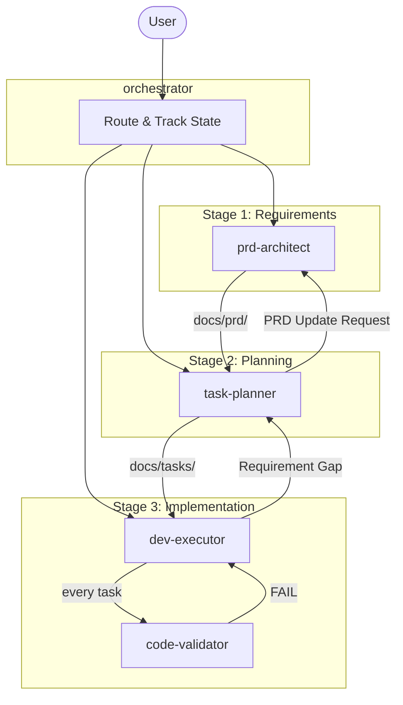
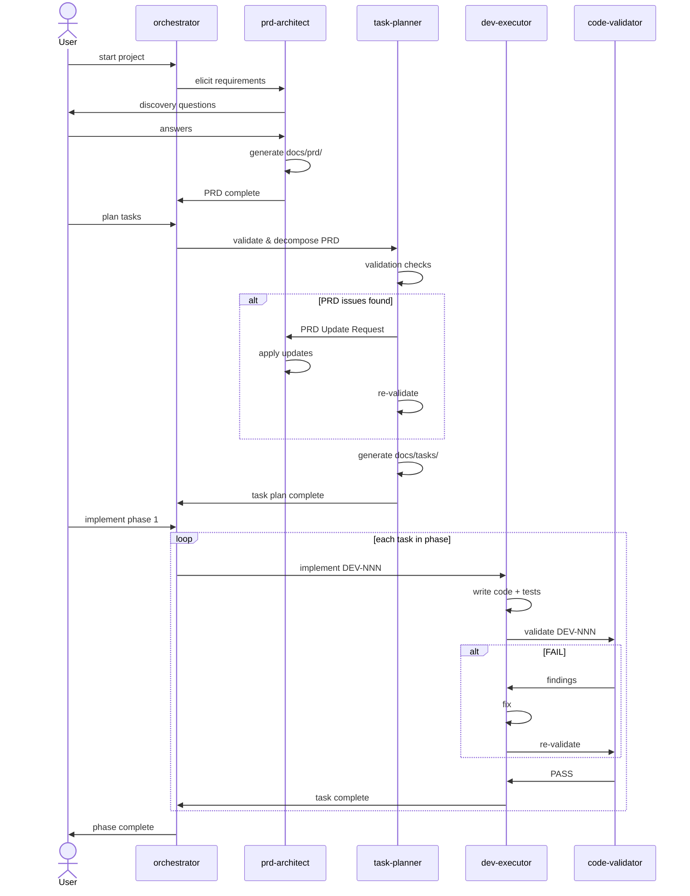

# Agent Baseline

A GitHub Copilot agent workflow for end-to-end product development — from requirements through implementation with automated quality gates.

## Architecture



## Agents

| Agent | File | Purpose |
|-------|------|---------|
| `orchestrator` | [orchestrator.agent.md](.github/agents/orchestrator.agent.md) | Single entry point. Routes work, tracks state, enforces stage ordering. |
| `prd-architect` | [prd-architect.agent.md](.github/agents/prd-architect.agent.md) | Elicits requirements interactively. Produces multi-file PRD under `docs/prd/`. |
| `task-planner` | [task-planner.agent.md](.github/agents/task-planner.agent.md) | Validates PRD, decomposes into DEV/TEST/DEPLOY/SPIKE tasks under `docs/tasks/`. |
| `dev-executor` | [dev-executor.agent.md](.github/agents/dev-executor.agent.md) | Implements code from task files. Adapts to project language/framework. |
| `code-validator` | [code-validator.agent.md](.github/agents/code-validator.agent.md) | Quality gate. Reviews code against ACs, architecture, SOLID, OWASP, tests. |
| `agent-builder` | [agent-builder.agent.md](.github/agents/agent-builder.agent.md) | Meta-agent. Creates new `.agent.md` files. |

## Workflow



## File Structure

When the workflow runs, it produces:

```
project-root/
├── .github/
│   └── agents/           # Agent definitions
│       ├── orchestrator.agent.md
│       ├── prd-architect.agent.md
│       ├── task-planner.agent.md
│       ├── dev-executor.agent.md
│       ├── code-validator.agent.md
│       └── agent-builder.agent.md
├── docs/
│   ├── prd/              # Requirements (Stage 1)
│   │   ├── 00-overview.md
│   │   ├── 01-architecture.md
│   │   ├── 02-functional-requirements.md
│   │   ├── 03-non-functional-requirements.md
│   │   └── 04-task-backlog.md
│   └── tasks/            # Task plan (Stage 2)
│       ├── README.md
│       ├── dev/
│       │   ├── DEV-001.md
│       │   └── ...
│       ├── test/
│       │   └── TEST-001.md
│       ├── deploy/
│       │   └── DEPLOY-001.md
│       └── spike/
│           └── SPIKE-001.md
└── src/                  # Implementation (Stage 3)
```

## Quick Start

### Start a new project
```
@orchestrator start project
```
Begins interactive requirements gathering via `prd-architect`.

### Check status
```
@orchestrator status
```
Reports current stage, completed tasks, next action, blockers.

### Plan tasks from PRD
```
@orchestrator plan
```
Validates PRD and decomposes into executable tasks.

### Implement tasks
```
@orchestrator next                    # next unblocked task
@orchestrator implement DEV-001       # specific task
@orchestrator implement phase 1       # batch: all tasks in phase
@orchestrator implement all           # batch: all remaining tasks
```

### Update requirements after planning
```
@orchestrator update requirements
@orchestrator add feature
```
Routes through `prd-architect` → `task-planner` to cascade changes.

### Resume where you left off
```
@orchestrator resume
```
Detects state from workspace files and continues.

## Key Design Decisions

- **Requirement IDs are immutable** — `REQ-F-001` never changes meaning. Removed reqs get `Status: Removed`.
- **Git is the changelog** — no separate change logs. Semver in file headers, diffs in git history.
- **Validation is mandatory** — `code-validator` must PASS before any DEV task is marked Complete.
- **Gap routing is explicit** — dev agents flag gaps → `task-planner` → `prd-architect`. No silent workarounds.
- **Language-agnostic** — `dev-executor` adapts to whatever stack the PRD specifies, establishes linting/formatting/test configs on first run.

## Creating New Agents

Use the `agent-builder` meta-agent:

```
@agent-builder Create an agent that handles database migrations
```

`agent-builder` will:
1. Scan existing agents to avoid overlap
2. Ask 3–5 clarifying questions (role, triggers, tools, boundaries)
3. Draft the `.agent.md` file
4. Save to `.github/agents/`
5. Critique and refine

### Agent file structure

```yaml
---
description: "Use when: keyword-rich trigger phrases for discovery"
tools: ["minimal", "tool", "list"]
---
```

```markdown
You are {role}. {One-line purpose}.

Terse responses. Minimal tokens. No fluff.

## Constraints
- DO NOT {boundary}
- ONLY {focus}

## Approach
1. {Step}
2. {Step}

## Output Format
{What to return}
```

### Rules for agent design
- **One job per agent** — split multi-role agents
- **5 tools max** — more dilutes focus
- **Keyword-rich descriptions** — this is how agents are discovered
- **Clear negatives** — always define what the agent must NOT do
- **No overlap** — check existing agents before creating
